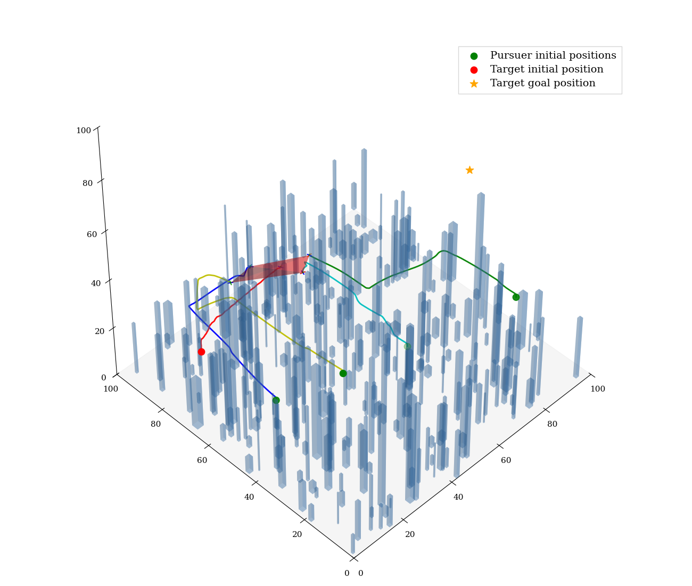
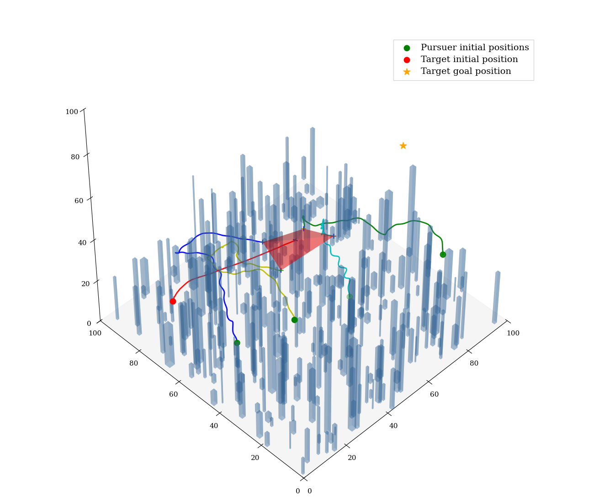

**English** | [中文](README_ZH.md)

# Hierarchical MPC-MAPPO (Multi-UAV Roundup)

## Overview

A 3D multi-UAV roundup system that combines **MAPPO** for high-level cooperative planning and **MPC** for safe low-level control. The framework uses **LiDAR-based convex feasible-region construction** to achieve efficient obstacle avoidance and stable cooperative encirclement in dense environments.

## Project Structure

- `algorithms/`: MAPPO implementations and neural network modules
- `control/`: low-level controllers (MPC / PID) and dynamics/geometry utilities
- `envs/`: simulation environments (including continuous-action envs and UAV interaction logic)
- `runner/`: training & evaluation runners (buffers, rollouts, logging)
- `train/`: training, evaluation, and visualization scripts
- `pic/`: figures and videos for demos/paper
- `results/`: training outputs (models, logs, etc.)

## Installation

```bash
pip install -r requirements.txt
```

## Usage

### Training

```bash
# Note: n_rollout_threads is recommended to be 18 (higher compute/memory cost).
# Reducing the number of parallel environments may slightly degrade performance.
python train/train.py --method MPC
python train/train.py --method PID
```

### Evaluate a Trained Model

> The paths below are examples from this repo. Please adjust `--model_dir` to match your local results directory.

```bash
python train/evaluate.py --episode_length 550 --model_dir results/MyEnv/MyEnv/mappo/check/run63/models --method MPC --n_eval_rollout_threads 1
python train/evaluate.py --episode_length 550 --model_dir results/MyEnv/MyEnv/mappo/check/run58/models --method PID --n_eval_rollout_threads 1
```

### Plot Training Curves

```bash
python train/reward_graph.py --log_dirs results/MyEnv/MyEnv/mappo/check/run58/logs results/MyEnv/MyEnv/mappo/check/run63/logs
```

## Results

### Example Snapshots

- MPC result:



- PID result:



## Videos

- Sparse obstacles: [`sparse_obstacle.mp4`](pic/sparse_obstacle.mp4)
- Dense obstacles: [`dense_obstacle.mp4`](pic/dense_obstacle.mp4)

## Contact

- `2381755917@qq.com`
- `xvchengxvcheng@proton.me` (less frequently used)

## Publication Status

This repository contains the experimental implementation and results for the manuscript:

**Drone Capture in Complex Obstacle Environments: A Hierarchical Framework Combining MPC and RL**

The paper is currently under submission/review and has not been formally published yet.
We will update this section with the publication venue, DOI, and/or arXiv link once available.

## Citation (Preliminary)

If you use this code, please cite the manuscript title for now:

```bibtex
@misc{drone_capture_hierarchical_mpc_rl,
  title={Drone Capture in Complex Obstacle Environments: A Hierarchical Framework Combining MPC and RL},
  author={xv cheng},
  year={2026},
  note={Manuscript under review}
}
```

## References

This project is built with inspiration from the following open-source repositories:

- [bobzwik/Quadcopter_SimCon](https://github.com/bobzwik/Quadcopter_SimCon)
- [duynamrcv/quadrotor_mpc_casadi](https://github.com/duynamrcv/quadrotor_mpc_casadi)
- [tinyzqh/light_mappo](https://github.com/tinyzqh/light_mappo)
- [Bharath2/Quadrotor-Simulation](https://github.com/Bharath2/Quadrotor-Simulation)
